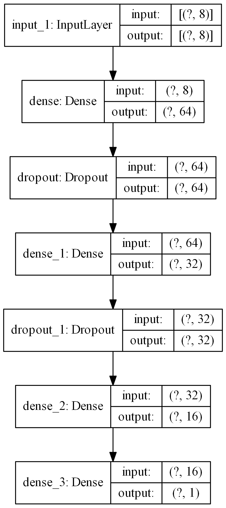
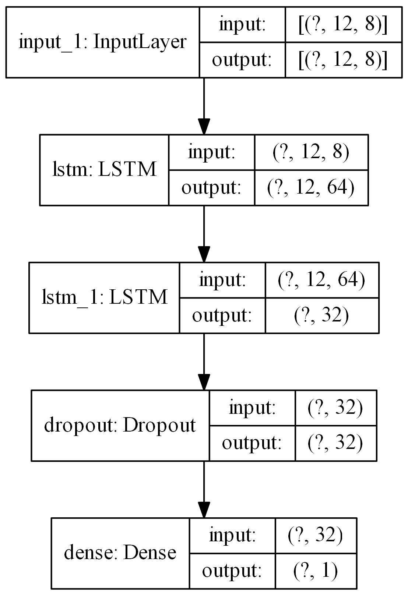
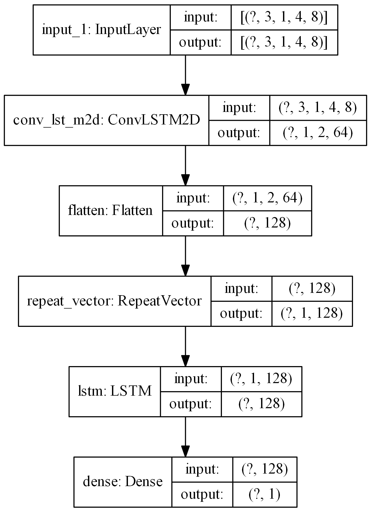
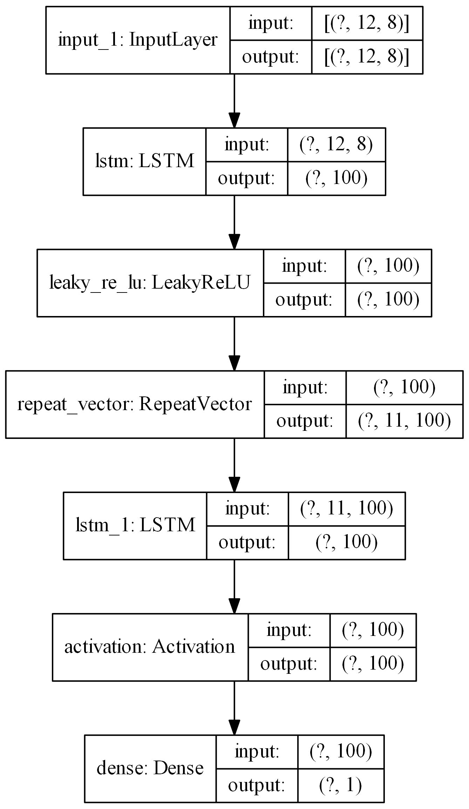
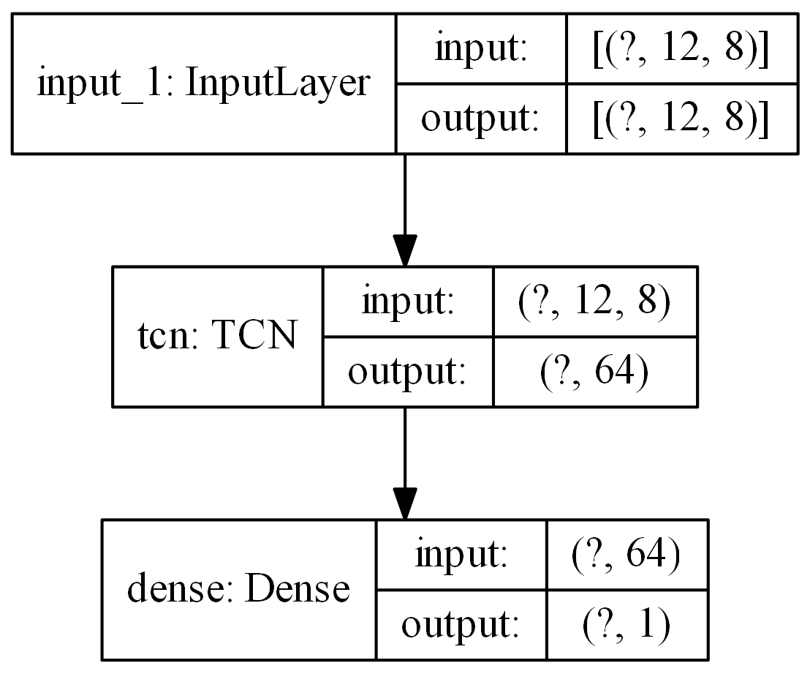
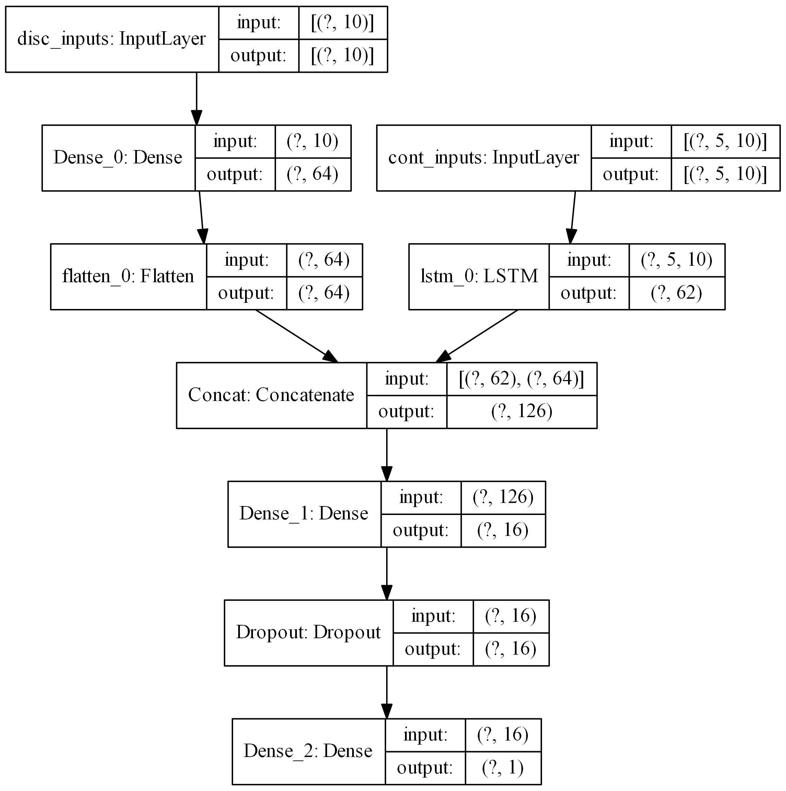
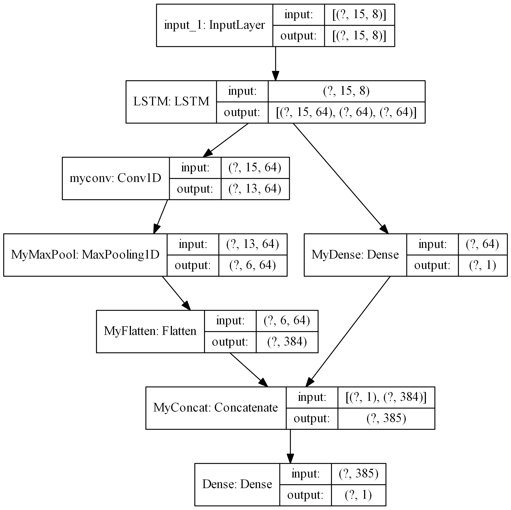
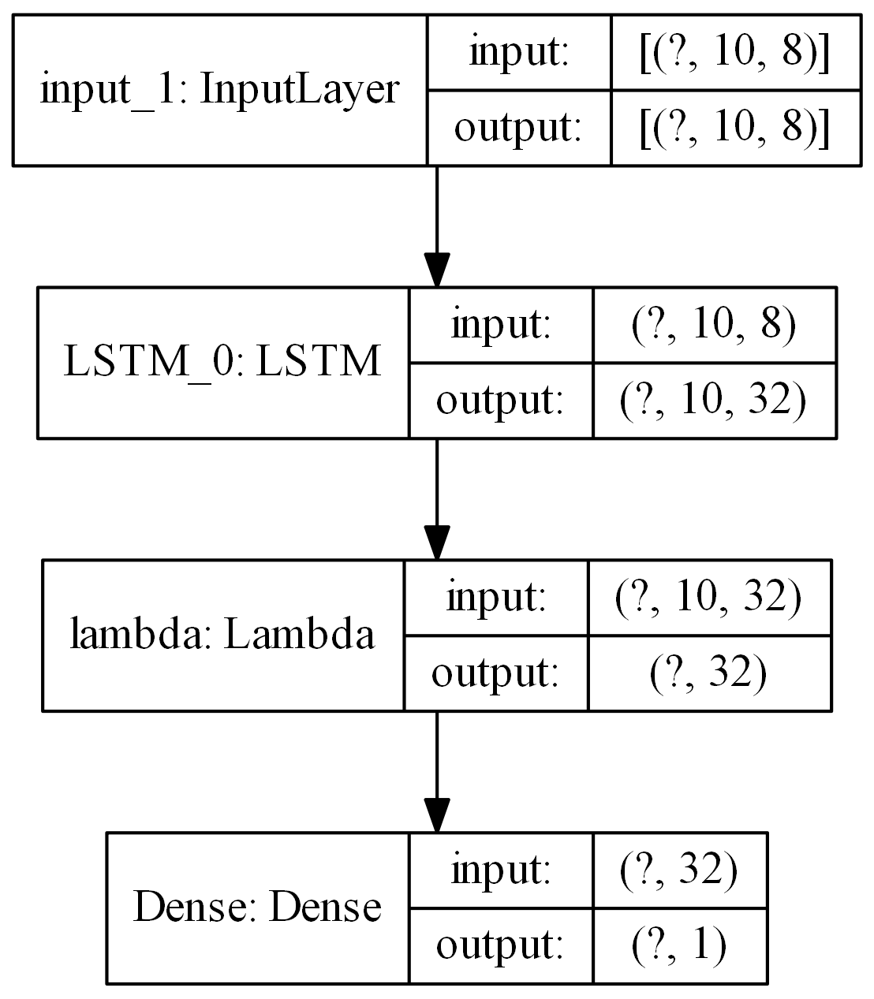

# dl4seq

[](https://travis-ci.com/AtrCheema/dl4seq)
[](https://coveralls.io/github/AtrCheema/dl4seq?branch=master)
[](https://www.codacy.com/gh/AtrCheema/dl4seq/dashboard?utm_source=github.com&amp;utm_medium=referral&amp;utm_content=AtrCheema/dl4seq&amp;utm_campaign=Badge_Grade)

Different deep learning based architechtures for time series forecasting.  
This repo provides a framework to build layered models from python dictionary and it provides several helper tools 
which fasten the process of  modeling time-series forcasting. The purpose to cut the time to write boiler plate code
in developing deep learning based models.

Most of the models in this repository have been adopted from other repositories in order to create an `all in one` code.
I have tried to reference the original repositories as well.

Currently following models are implemented

| Name                          | Name in this repository  | Reference |
| -------------------------- | ------------- | ---------- |
| MLP  | `Model` | |
| LSTM | ٭ | |
| CNN  | * |  |
| LSTM CNN | * |  |
| CNN LSTM |  * |  |
| Autoencoder  | * |  |
| ConvLSTM | * | [paper](https://arxiv.org/abs/1506.04214v1) [Code](https://machinelearningmastery.com/how-to-develop-lstm-models-for-multi-step-time-series-forecasting-of-household-power-consumption/) |
| Temporal Convolutional Networks (TCN)  | * | [paper](https://www.nature.com/articles/s41598-020-65070-5) [code](https://github.com/philipperemy/keras-tcn) |
| Iterpretable Multivariate LSTM (IMV-LSTM)  | `IMVLSTMModel` | [paper](https://arxiv.org/pdf/1905.12034.pdf) [code](https://github.com/KurochkinAlexey/IMV_LSTM) |
| HARHN  | `HARHNModel` | [paper](https://arxiv.org/abs/1806.00685) [code](https://github.com/KurochkinAlexey/Hierarchical-Attention-Based-Recurrent-Highway-Networks-for-Time-Series-Prediction)|
| Neural Beats  | `NBeatsModel` | [paper](https://arxiv.org/pdf/1905.10437.pdf) |
| Dual Attention | `DualAttentionModel` | [paper](https://arxiv.org/pdf/1704.02971.pdf) [code]() |
| Input Attention  | `InputAttentionModel` | |

`*` These models can be constructed by stacking layers in a python dictionary as shown later here. The remaining models 
can be used as shown below

## Installation

using github link for the latest code

	python -m pip install git+https://github.com/AtrCheema/dl4seq.git

using setup file, go to folder where repo is downloaded

    python setup.py install

## How to use

    ```python
    import pandas as pd 
    from dl4seq import InputAttentionModel  # import any of the above model
    from dl4seq.utils import make_model  # helper function to make inputs for model
    
    data_config, nn_config, total_intervals = make_model(batch_size=16,
                                                         lookback=15,
                                                         lr=0.001)
    df = pd.read_csv('data/all_data_30min.csv')
    
    model = InputAttentionModel(data_config=data_config,
                  nn_config=nn_config,
                  data=df,
                  intervals=total_intervals
                  )
    
    model.build_nn()
    
    history = model.train_nn(indices='random')
    
    preds, obs = model.predict()
    acts = model.view_model()
    ```

## Build using python dictionary

We can construct a normal layered model using keras layers by placing the layers in a dictionary. The keys in the
dictionary must be a keras layer and optionally can have an identifier separated by an underscore `_` in order to 
differentiate it from other similar layers in the model. The input/initializating arguments in the layer must be
enclosed in a `config` dictionary within the layer. To find out what input/initializing arguments can be used, check
documentation of corresponding layer in `Tensorflow` docs. 

### multi-layer perceptron

    ```python
    from dl4seq.utils import make_model
    from dl4seq import Model
    
    import pandas as pd
    
    layers = {"Dense_0": {'config': {'units': 64, 'activation': 'relu'}},
              "Dropout_0": {'config': {'rate': 0.3}},
              "Dense_1": {'config': {'units': 32, 'activation': 'relu'}},
              "Dropout_1": {'config': {'rate': 0.3}},
              "Dense_2": {'config': {'units': 16, 'activation': 'relu'}},
              "Dense_3": {'config': {'units': 1}}
              }
    
    data_config, nn_config, _ = make_model(batch_size=16,
        lookback=1,
        lr=0.001,
        epochs=2)
    nn_config['layers'] = layers
    
    df = pd.read_csv('data/all_data_30min.csv')
    
    _model = Model(data_config=data_config,
                  nn_config=nn_config,
                  data=df
                  )
    
    _model.build_nn()
    ```


### LSTM based model
    ```python
    from dl4seq.utils import make_model
    from dl4seq import Model
    import pandas as pd
    
    layers = {"LSTM_0": {'config': {'units': 64, 'return_sequences': True}},
              "LSTM_1": {'config': {'units': 32}},
              "Dropout": {'config': {'rate': 0.3}},
              "Dense": {'config': {'units': 1}}
              }
    data_config, nn_config, _ = make_model(batch_size=16,
        lookback=1,
        lr=0.001,
        epochs=2)
    nn_config['layers'] = layers
    
    df = pd.read_csv("data/all_data_30min.csv")
    
    _model = Model(data_config=data_config,
                  nn_config=nn_config,
                  data=df
                  )
    
    _model.build_nn()
    ```


### 1d CNN based model
If a layer does not receive any input arguments for its initialization, still an empty dictioanry must be provided.  
Activation functions can also be used as a separate layer.
    ```python
    layers = {"Conv1D_9": {'config': {'filters': 64, 'kernel_size': 2}},
              "dropout": {'config': {'rate': 0.3}},
              "Conv1D_1": {'config': {'filters': 32, 'kernel_size': 2}},
              "maxpool1d": {'config': {'pool_size': 2}},
              'flatten': {'config': {}}, # This layer does not receive any input arguments
              'leakyrelu': {'config': {}},  # activation function can also be used as a separate layer
              "Dense": {'config': {'units': 1}}
              }
    ```


### LSTM -> CNN based model
    ```python
    layers = {"LSTM": {'config': {'units': 64, 'return_sequences': True}},
              "Conv1D_0": {'config': {'filters': 64, 'kernel_size': 2}},
              "dropout": {'config': {'rate': 0.3}},
              "Conv1D_1": {'config': {'filters': 32, 'kernel_size': 2}},
              "maxpool1d": {'config': {'pool_size': 2}},
              'flatten': {'config': {}},
              'leakyrelu': {'config': {}},
              "Dense": {'config': {'units': 1}}
              }
    ```


### ConvLSTM based model
    ```python
    layers = {'convlstm2d': {'config': {'filters': 64, 'kernel_size': (1, 3), 'activation': 'relu'}},
              'flatten': {'config': {}},
              'repeatvector': {'config': {'n': 1}},
              'lstm':   {'config': {'units': 128,   'activation': 'relu', 'dropout': 0.3, 'recurrent_dropout': 0.4 }},
              'Dense': {'config': {'units': 1}}
              }
    ```


### CNN -> LSTM
If a layer is to be enclosed in `TimeDistributed` layer, just add the layer followed by `TimeDistributed` as shown below.
In following, 3 `Conv1D` layers are enclosed in `TimeDistributed` layer. Similary `Flatten` and `MaxPool1D` are also 
wrapped in `TimeDistributed` layer.
    ```python
    sub_sequences = 3
    lookback = 15
    time_steps = lookback // sub_sequences
    layers = {
        "Input": {'config': {'shape': (None, time_steps, 10)}},
        "TimeDistributed_0": {'config': {}},
        'conv1d_0': {'config': {'filters': 64, 'kernel_size': 2}},
        'LeakyRelu_0': {'config': {}},
        "TimeDistributed_1": {'config': {}},
        'conv1d_1': {'config': {'filters': 32, 'kernel_size': 2}},
        'elu_1': {'config': {}},
        "TimeDistributed_2": {'config': {}},
        'conv1d_2': {'config': {'filters': 16, 'kernel_size': 2}},
        'tanh_2': {'config': {}},
        "TimeDistributed_3": {'config': {}},
        "maxpool1d": {'config': {'pool_size': 2}},
        "TimeDistributed_4": {'config': {}},
        'flatten': {'config': {}},
        'lstm_0':   {'config': {'units': 64, 'activation': 'relu', 'dropout': 0.4, 'recurrent_dropout': 0.5, 'return_sequences': True,
                   'name': 'lstm_0'}},
        'Relu_1': {'config': {}},
        'lstm_1':   {'config': {'units': 32, 'activation': 'relu', 'dropout': 0.4, 'recurrent_dropout': 0.5, 'name': 'lstm_1'}},
        'sigmoid_2': {'config': {}},
        'Dense': {'config': {'units': 1}}
    }
    ```


### LSTM based auto-encoder
    ```python
    layers = {
        'lstm_0': {'config': {'units': 100,  'dropout': 0.3, 'recurrent_dropout': 0.4}},
        "leakyrelu_0": {'config': {}},
        'RepeatVector': {'config': {'n': 11}},
        'lstm_1': {'config': {'units': 100,  'dropout': 0.3, 'recurrent_dropout': 0.4}},
        "relu_1": {'config': {}},
        'Dense': {'config': {'units': 1}}
    }
    ```


### TCN layer
You can use third party layers such as [`tcn`](https://github.com/philipperemy/keras-tcn) which is currently not supported by Tensorflow. Provided you have 
installed `tcn`, the layer along with its arguments can be used as following
    ```python
    layers = {"tcn": {'config': {'nb_filters': 64,
                      'kernel_size': 2,
                      'nb_stacks': 1,
                      'dilations': [1, 2, 4, 8, 16, 32],
                      'padding': 'causal',
                      'use_skip_connections': True,
                      'return_sequences': False,
                      'dropout_rate': 0.0}},
              'Dense': {'config': {'units': 1}}
              }
    ```


### Multiple Inputs
In order to build more complex models, where a layer takes more than one inputs, you can specify the `inputs` key
for the layer and specify which inputs the layer uses. The `value` of the `inputs` dictionary must be a `list` in this
case whose members must be the names of the layers which must have been defined earlier.

    ```python
    from dl4seq import Model
    class MyModel(Model):
    
        def run_paras(self, **kwargs) -> (list, list):
            """ write code which returns x and y where x consits of [(samples, 5, 10), (samples, 10)] and y consits of 
                list [(samples, 1)]
             """
            return 
    
    
    layers = {"Input_0": {"config": {"shape": (5, 10), "name": "cont_inputs"}},
              "lstm_0": {"config": { "units": 62,  "activation": "leakyrelu", "dropout": 0.4,  "recurrent_dropout": 0.4, "return_sequences": False,  "name": "lstm_0"},
                         "inputs": "cont_inputs"},
    
              "Input_1": {"config": {"shape": 10, "name": "disc_inputs"}},
              "Dense_0": {"config": {"units": 64,"activation": "leakyrelu", "name": "Dense_0"},
                          "inputs": "disc_inputs"},
              "flatten_0": {"config": {"name": "flatten_0" },
                            "inputs": "Dense_0"},
    
              "Concat": {"config": {"name": "Concat" },
                         "inputs": ["lstm_0", "flatten_0"]},
    
              "Dense_1": {"config": {"units": 16, "activation": "leakyrelu", "name": "Dense_1"}},
              "Dropout": {"config": {"rate": 0.4, "name": "Dropout"}},
              "Dense_2": {"config": {"units": 1, "name": "Dense_2"}}
            }
    ```
As the above model takes two inputs, we will have to overwrite `run_paras` method in our own class which should inherit
from `Model` class



### Multiple Output Layers
In some cases a layer returns more than one output and we want to use each of those outputs in a separate layer. Such
models can be built by specifying the outputs from a layer using `outputs` key. The `value` of the `outputs` key can a
string or a list of strings specifying the names of of outputs, the layer is returning. We can use these names as inputs
to any other layer later in the model. 

    ```python
    layers = {
        "LSTM": {'config': {'units': 64, 'return_sequences': True, 'return_state': True},
                 'outputs': ['junk', 'h_state', 'c_state']},
    
        "Dense_0": {'config': {'units': 1, 'name': 'MyDense'},
                  'inputs': 'h_state'},
    
        "Conv1D_1": {'config': {'filters': 64, 'kernel_size': 3, 'name': 'myconv'},
                    'inputs': 'junk'},
        "MaxPool1D": {'config': {'name': 'MyMaxPool'},
                    'inputs': 'myconv'},
        "Flatten": {'config': {'name': 'MyFlatten'},
                    'inputs': 'MyMaxPool'},
    
        "Concat": {'config': {'name': 'MyConcat'},
                'inputs': ['MyDense', 'MyFlatten']},
    
        "Dense": {'config': {'units':1},
                  'inputs': "MyConcat"}
    }
    ```


### Additional call args
We might be tempted to provide additional call arguments to a layer. For example, in tensorflow's [LSTM layer](https://www.tensorflow.org/api_docs/python/tf/keras/layers/LSTM#call_arguments_2), we can
provide `initial state` of an LSTM. Suppose we want to use hidden and cell state of one LSTM as initial state for next
LSTM. In such cases we can make use of `call_args` as `key`. The value of `call_args` must a dictionary. In this way
we can provide `keyword` arguments while calling a layer.

    ```python
    lookback = 5
    input_features = ['temp', 'pressure', 'volume']
    output_features = ['spped']
    layers ={
        "Input": {'config': {'shape': (lookback, len(input_features)), 'name': "MyInputs"}},
        "LSTM": {'config': {'units': 64, 'return_sequences': True, 'return_state': True, 'name': 'MyLSTM1'},
                 'inputs': 'MyInputs',
                 'outputs': ['junk', 'h_state', 'c_state']},
    
        "Dense_0": {'config': {'units': 1, 'name': 'MyDense'},
                  'inputs': 'h_state'},
    
        "Conv1D_1": {'config': {'filters': 64, 'kernel_size': 3, 'name': 'myconv'},
                    'inputs': 'junk'},
        "MaxPool1D": {'config': {'name': 'MyMaxPool'},
                    'inputs': 'myconv'},
        "Flatten": {'config': {'name': 'MyFlatten'},
                    'inputs': 'MyMaxPool'},
    
        "LSTM_3": {"config": {'units': 64, 'name': 'MyLSTM2'},
                   'inputs': 'MyInputs',
                   'call_args': {'initial_state': ['h_state', 'c_state']}},
    
        "Concat": {'config': {'name': 'MyConcat'},
                'inputs': ['MyDense', 'MyFlatten', 'MyLSTM2']},
    
        "Dense": {'config': {'units':len(output_features)},
                  'inputs': "MyConcat"}
    }
    ```


It must be noted that the keys `inputs`, `outputs`, and `call_args` are optional while `config` is mandatory.

### lambda layers
You can also add [`lambda`](https://www.tensorflow.org/api_docs/python/tf/keras/layers/Lambda) layers by placing the 
lambda layer definition in the `config` as following:
    ```python
    import tensorflow as tf
    from dl4seq import Model
    import pandas as pd
    
    layers = {
        "LSTM_0": {"config": {"units": 32, "return_sequences": True}},
        "lambda": {"config": tf.keras.layers.Lambda(lambda x: x[:, -1, :])},
        "Dense": {"config": {"units": 1}}
    }
    
    # The model can be seelessly loaded from the saved json file using
    
    config_path = "path like"
    df = pd.read_csv('data/data.csv')
    model = Model.from_config(config_path=config_path, data=df)
    ```


For more examples see `docs`.

## Disclaimer
Athough the purpose of this repo is purportedly `all_in_one` model, however there is no `one_for_all` model. For each
deep learning proble, the model needs to be build accordingly. I made this repo to teach myself deep learning for time
series prediction. 