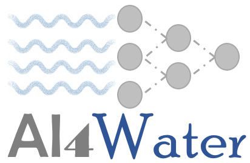

# Welcome to AI4Water

For code visit [github](https://github.com/AtrCheema/AI4Water).

# AI4Water



A uniform and simplified framework for rapid expermenting with deep leanring and machine 
learning based models for time series and structured data. 

The specific purposes of the repository are
- compliment the functionality of `keras`/`pytorch`/`sklearn` by making pre and 
 post processing easeier for time-series prediction/classification problems (also holds
 true for any 1D data).
 
- save, load/reload or build models from readable json file. This repository 
 provides a framework to build layered models using python dictionary and with 
 several helper tools which fasten the process of  modeling time-series forcasting.

- both of above functionalities should be available without complicating keras 
 implementation.

- provide a uniform interface for optimizing hyper-parameters for 
 [skopt](https://scikit-optimize.github.io/stable/index.html);
 [sklearn](https://scikit-learn.org/stable/modules/classes.html#hyper-parameter-optimizers) 
 based [grid](https://scikit-learn.org/stable/modules/generated/sklearn.model_selection.GridSearchCV.html) 
 and [random](https://scikit-learn.org/stable/modules/generated/sklearn.model_selection.RandomizedSearchCV.html);
  [hyperopt](http://hyperopt.github.io/hyperopt/) based 
  [tpe](https://papers.nips.cc/paper/2011/file/86e8f7ab32cfd12577bc2619bc635690-Paper.pdf), 
  [atpe](https://www.electricbrain.io/blog/learning-to-optimize) or 
  [optuna](https://optuna.readthedocs.io/en/stable/) based 
  [tpe](https://optuna.readthedocs.io/en/stable/reference/generated/optuna.samplers.TPESampler.html), 
  [cmaes](https://optuna.readthedocs.io/en/stable/reference/generated/optuna.samplers.CmaEsSampler.html) etc. 
  See [example](https://github.com/AtrCheema/AI4Water/blob/master/examples/hyper_para_opt.ipynb)  
  using its application.
- It should be possible to overwrite/customize any of the functionality of the AI4Water's `Model` 
 by subclassing the
 `Model`. So at the highest level you just need to initiate the `Model`, and then need `fit`, `predict` and 
 `view_model` methods of `Model` class but you can go as low as you could go with tensorflow/keras. 

- cut short the time to write boiler plate code in developing machine learning 
 based models.


## Installation

using github link

	python -m pip install git+https://github.com/AtrCheema/AI4Water.git

using setup file, go to folder where repo is downloaded

    python setup.py install

The latest code however (possibly with less bugs and more features) can be insalled from `dev` branch instead

    python -m pip install git+https://github.com/AtrCheema/AI4Water.git@dev

To install the latest branch (`dev`) with all requirements use the following command

    python -m pip install "AI4Water[all] @ git+https://github.com/AtrCheema/AI4Water.git@dev"
 
## How to use

Build a `Model` by providing all the arguments to initiate it.

```python
from AI4Water import Model
from AI4Water.utils.datasets import arg_beach
data = arg_beach()
model = Model(
        model = {'layers': {"LSTM": 64}},
        data = data,
        input_features=['tide_cm', 'wat_temp_c', 'sal_psu', 'air_temp_c', 'pcp_mm'],   # columns in csv file to be used as input
        output_features = ['tetx_coppml'],     # columns in csv file to be used as output
        lookback = 12
)
```

Train the model by calling the `fit()` method
```python
history = model.fit()
```

Make predictions from it
```python
true, predicted = model.predict()
```


## Using your own pre-processed data
You can use your own pre-processed data without using any of pre-processing tools of AI4Water. You will need to provide
input output paris to `data` argument to `fit` and/or `predict` methods.
```python
import numpy as np
from AI4Water import Model  # import any of the above model

batch_size = 16
lookback = 15
inputs = ['dummy1', 'dummy2', 'dummy3', 'dumm4', 'dummy5']  # just dummy names for plotting and saving results.
outputs=['DummyTarget']

model = Model(
            model = {'layers': {"LSTM": 64,
                                'Dense': 1}},
            batch_size=batch_size,
            lookback=lookback,
            input_features=inputs,
            output_features=outputs,
            lr=0.001
              )
x = np.random.random((batch_size*10, lookback, len(inputs)))
y = np.random.random((batch_size*10, len(outputs)))

history = model.fit(x=x,y=y)

```

## using for `scikit-learn`/`xgboost`/`lgbm`/`catboost` based models
The repository can also be used for machine learning based models such as scikit-learn/xgboost based models for both
classification and regression problems by making use of `model` keyword arguments in `Model` function.
However, integration of ML based models is not complete yet.
```python
from AI4Water import Model
from AI4Water.utils.datasets import arg_beach

data = arg_beach()  # path for data file

model = Model(
        input_features=['tide_cm', 'wat_temp_c', 'sal_psu', 'air_temp_c', 'pcp_mm'],   # columns in csv file to be used as input
        output_features = ['tetx_coppml'],  
        lookback=1,
        val_fraction=0.0,
        #  any regressor from https://scikit-learn.org/stable/modules/classes.html
        model={"randomforestregressor": {"n_estimators":1000}},  # set any of regressor's parameters. e.g. for RandomForestRegressor above used,
    # some of the paramters are https://scikit-learn.org/stable/modules/generated/sklearn.ensemble.RandomForestRegressor.html#sklearn.ensemble.RandomForestRegressor
        data=data
              )

history = model.fit()

preds, obs = model.predict()
```

