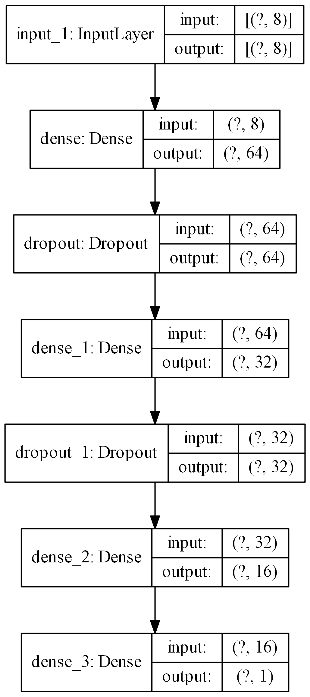
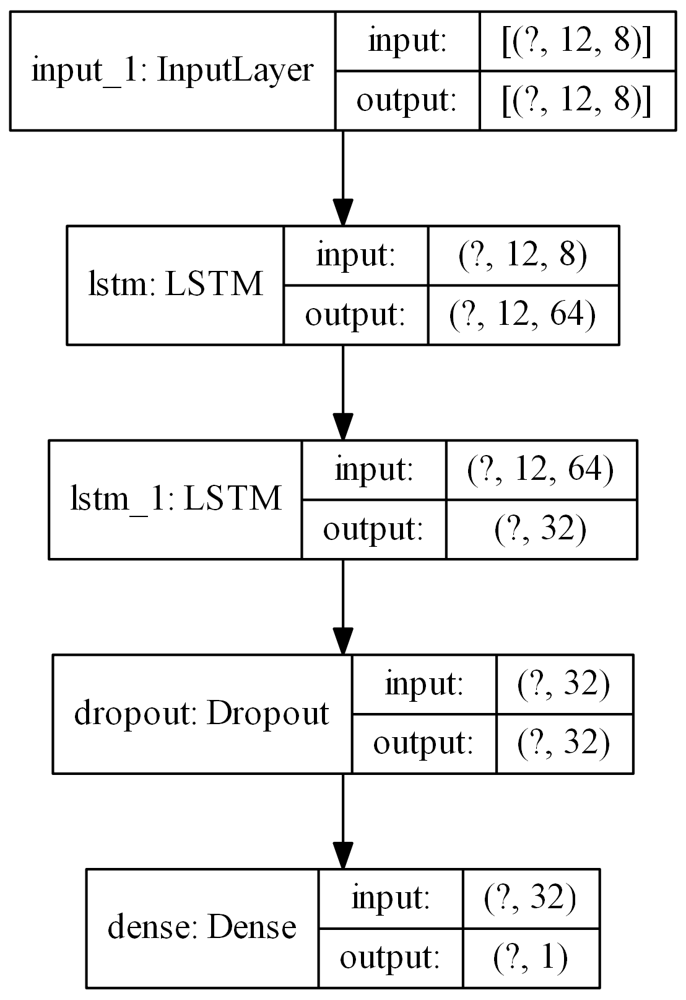
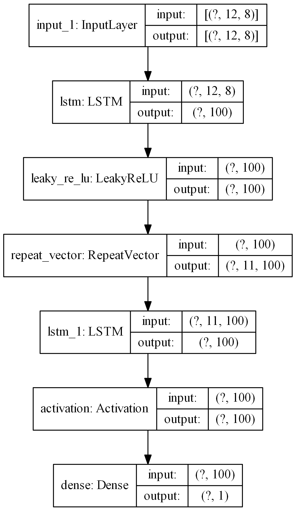
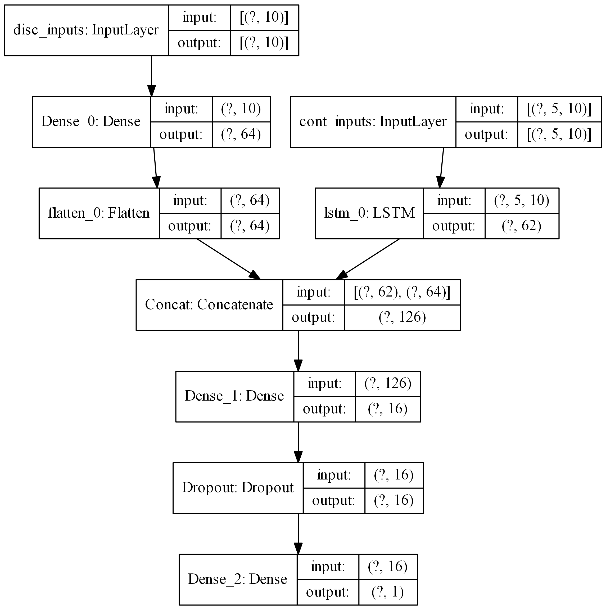
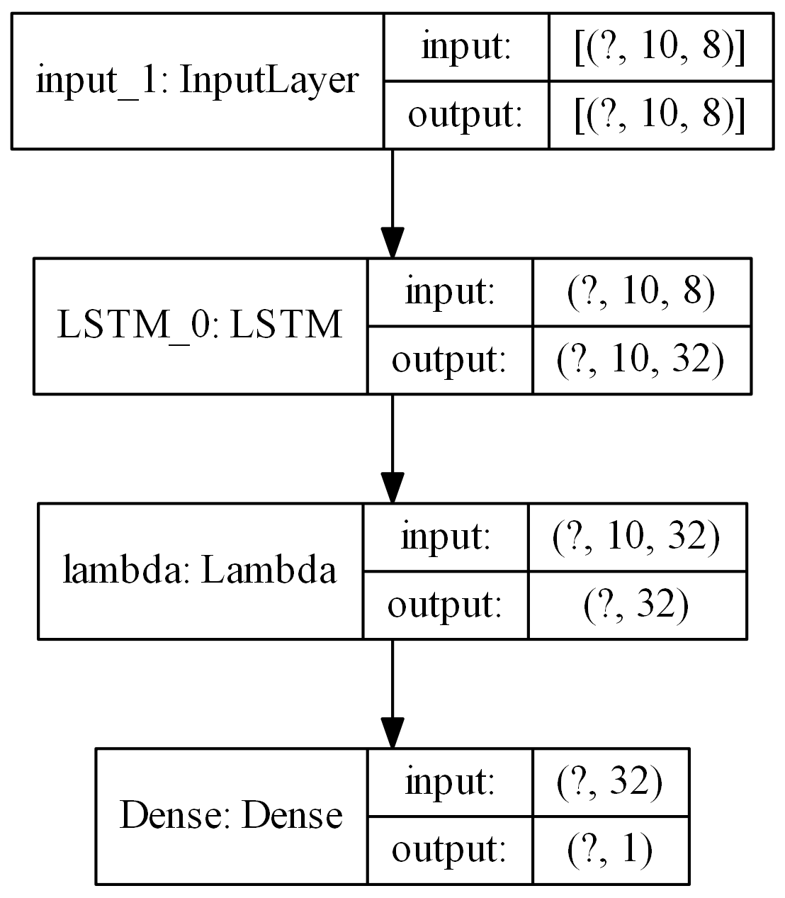

.. _dec_def_tf:

declarative model definition for tensorflow
*******************************************

We can construct a normal layered model using keras layers by placing the layers in a dictionary. The keys in the
dictionary must be a keras layer and optionally can have an identifier separated by an underscore `_` in order to 
differentiate it from other similar layers in the model. For example `Dense_0` and `Dense_1` are two 
Dense_ layers.
The input/initializing arguments in the layer must be
enclosed in a dictionary within the layer. To find out what input/initializing arguments can be used, check
documentation of corresponding layer in Tensorflow_  docs.
It should be noted that the layer name is case-sensitive. Therefore, Dense layer cannot be DENSE.

multi-layer perceptron
======================

.. code-block:: python

    >>> from ai4water import Model
    >>> from ai4water.datasets import arg_beach
    >>> import pandas as pd
    ...
    >>> layers = {"Dense_0": {'units': 64, 'activation': 'relu'},
    ...           "Dropout_0": 0.3,  # 0.3 here refers to 'rate' keyword argument in Dropout layer in Tensorflow API
    ...           "Dense_1": {'units': 32, 'activation': 'relu'},
    ...           "Dropout_1": 0.3,
    ...           "Dense_2": {'units': 16, 'activation': 'relu'},
    ...           "Dense_3": 1     # 1 refers to 'units' keyword argument in Dense layer in Tensorflow
    ...           }
    ...
    >>> df = arg_beach()
    ...
    >>> model = Model(
    ...             input_features=df.columns.tolist()[0:-1],
    ...             output_features=df.columns.tolist()[-1:],
    ...             model={'layers':layers},
    ...               )

LSTM based model
=================
In following case a Dense_ layer with one `units` is added automatically at the end of
second `LSTM` layer.

.. code-block:: python

    >>> import pandas as pd
    ...
    >>> from ai4water import Model
    >>> from ai4water.datasets import arg_beach
    ...
    >>> layers = {"LSTM_0": {'units': 64, 'return_sequences': True},
    ...           "LSTM_1": 32,
    ...           "Dense": 1
    ...           }
    ...
    >>> df = arg_beach
    ...
    >>> model = Model(ts_args={"lookback": 12}
    ...               input_features=df.columns.tolist()[0:-1],
    ...               output_features=df.columns.tolist()[-1:],
    ...               model={'layers':layers})

1d CNN based model
====================
If a layer does not receive any input arguments for its initialization, still an empty dictionary must be provided.
Activation functions can also be used as a separate layer.

.. code-block:: python

    >>> layers = {"Conv1D_9": {'filters': 64, 'kernel_size': 2},
    ...           "Dropout": 0.3,
    ...           "Conv1D_1": {'filters': 32, 'kernel_size': 2},
    ...           "MaxPool1D": 2,
    ...           'Flatten': {}, # This layer does not receive any input arguments
    ...           'LeakyReLU': {},  # activation function can also be used as a separate layer
    ...           "Dense": 1
    ...           }

LSTM -> CNN based model
========================

.. code-block:: python

    >>> layers = {"LSTM": {'units': 64, 'return_sequences': True},
    ...           "Conv1D_0": {'filters': 64, 'kernel_size': 2},
    ...           "Dropout": 0.3,
    ...           "Conv1D_1": {'filters': 32, 'kernel_size': 2},
    ...           "MaxPool1D": 2,
    ...           'Flatten': {},
    ...           'LeakyReLU': {},
    ...           "Dense": 1
    ...           }

ConvLSTM based model
=====================
AI4Water will infer input shape for general cases however it is better to explicitly define the Input_ layer
when the input is > 3d or the number of inputs are more than one.

.. code-block:: python

    >>> layers = {'Input': {'shape': (3, 1, 4, 8)},
    ...           'ConvLSTM2D': {'filters': 64, 'kernel_size': (1, 3), 'activation': 'relu'},
    ...           'Flatten': {},
    ...           'RepeatVector': 1,
    ...           'LSTM':   {'units': 128,   'activation': 'relu', 'dropout': 0.3, 'recurrent_dropout': 0.4 },
    ...           'Dense': 1
    ...           }

CNN -> LSTM
==========================
If a layer is to be enclosed in `TimeDistributed` layer, just add the layer followed
by `TimeDistributed` as shown below. In following, 3 `Conv1D` layers are enclosed
in `TimeDistributed` layer. Similarly `Flatten` and `MaxPool1D` are also
wrapped in `TimeDistributed` layer.

.. code-block:: python

    >>> sub_sequences = 3
    >>> lookback = 15
    >>> time_steps = lookback // sub_sequences
    >>> layers = {
    ...     "Input": {'config': {'shape': (None, time_steps, 10)}},
    ...     "TimeDistributed_0": {},
    ...     'Conv1D_0': {'filters': 64, 'kernel_size': 2},
    ...     'LeakyReLU_0': {},
    ...     "TimeDistributed_1":{},
    ...     'Conv1D_1': {'filters': 32, 'kernel_size': 2},
    ...     'ELU_1': {},
    ...         "TimeDistributed_2": {},
    ...     'Conv1D_2': {'filters': 16, 'kernel_size': 2},
    ...     'tanh_2': {},
    ...     "TimeDistributed_3": {},
    ...     "MaxPool1D": {'pool_size': 2},
    ...     "TimeDistributed_4": {},
    ...     'Flatten': {},
    ...     'LSTM_0':   {'units': 64, 'activation': 'relu', 'dropout': 0.4, 'recurrent_dropout': 0.5,
    ...                   'return_sequences': True,  'name': 'lstm_0'},
    ...     'relu_1': {},
    ...     'LSTM_1':   {'units': 32, 'activation': 'relu', 'dropout': 0.4,
    ...                   'recurrent_dropout': 0.5, 'name': 'lstm_1'},
    ...     'sigmoid_2': {},
    ...     'Dense': 1
    >>> }

LSTM based auto-encoder
========================

.. code-block:: python

    >>> layers = {
    ...     'LSTM_0': {'units': 100,  'dropout': 0.3, 'recurrent_dropout': 0.4},
    ...     "LeakyReLU_0": {},
    ...     'RepeatVector': 11,
    ...     'LSTM_1': {'units': 100,  'dropout': 0.3, 'recurrent_dropout': 0.4},
    ...     "relu_1": {},
    ...     'Dense': 1
    >>> }

TCN layer
=========
You can use third party layers such as `tcn`_  which is currently not supported by
Tensorflow. Provided you have installed `tcn`, the layer along with its arguments
can be used as following

.. code-block:: python

    >>> layers = {"TCN": {'nb_filters': 64,
    ...                   'kernel_size': 2,
    ...                   'nb_stacks': 1,
    ...                   'dilations': [1, 2, 4, 8, 16, 32],
    ...                   'padding': 'causal',
    ...                   'use_skip_connections': True,
    ...                   'return_sequences': False,
    ...                   'dropout_rate': 0.0},
    ...           'Dense': 1
    >>>           }

Multiple Inputs
===============
In order to build more complex models, where a layer takes more than one inputs,
you can specify the `inputs` key for the layer and specify which inputs the
layer uses.  The `value` of the `inputs` dictionary must be a `list` in this
case whose members must be the names of the layers which must have been defined
earlier. The input/initializing arguments in the layer must be enclosed in a
`config` dictionary within the layer in such cases.

.. code-block:: python

    >>> from ai4water import Model
    >>> class MyModel(Model):
    ...
    >>>     def training_data(self, **kwargs) -> (list, list):
    ...         """ write code which returns x and y where x consists of [(samples, 5, 10), (samples, 10)] and y consists of
    ...             list [(samples, 1)]
    ...          """
    >>>         return
    ...
    >>>     def test_data(self, **kwargs):
    >>>         return

    >>> layers = {"Input_0": {"shape": (5, 10), "name": "cont_inputs"},
    ...           "LSTM_0": {"config": { "units": 62,  "activation": "leakyrelu", "dropout": 0.4,
    ...                                  "recurrent_dropout": 0.4, "return_sequences": False,  "name": "lstm_0"},
    ...                      "inputs": "cont_inputs"},

    ...           "Input_1": {"shape": 10, "name": "disc_inputs"},
    ...           "Dense_0": {"config": {"units": 64,"activation": "leakyrelu", "name": "Dense_0"},
    ...                       "inputs": "disc_inputs"},
    ...           "Flatten_0": {"config": {"name": "flatten_0" },
    ...                         "inputs": "Dense_0"},
    ...
    ...           "Concatenate": {"config": {"name": "Concat" },
    ...                      "inputs": ["lstm_0", "flatten_0"]},
    ...
    ...           "Dense_1": {"units": 16, "activation": "leakyrelu", "name": "Dense_1"},
    ...           "Dropout": 0.4,
    ...           "Dense_2": 1
    >>>         }

As the above model takes two inputs, we will have to overwrite `training_data`, 
`validation_data` and  `test_data` methods in our own class which should inherit
from `Model` class

Multiple Output Layers
=======================
In some cases a layer returns more than one output and we want to use each of
those outputs in a separate layer. Such models can be built by specifying the
outputs from a layer using `outputs` key. The `value` of the `outputs` key can a
string or a list of strings specifying the names of of outputs, the layer is
returning. We can use these names as inputs to any other layer later in the model.

.. code-block:: python

    >>> layers = {
    ...     "LSTM": {'config': {'units': 64, 'return_sequences': True, 'return_state': True},
    ...              'outputs': ['junk', 'h_state', 'c_state']},

    ...     "Dense_0": {'config': {'units': 1, 'name': 'MyDense'},
    ...               'inputs': 'h_state'},

    ...     "Conv1D_1": {'config': {'filters': 64, 'kernel_size': 3, 'name': 'myconv'},
    ...                 'inputs': 'junk'},
    ...     "MaxPool1D": {'config': {'name': 'MyMaxPool'},
    ...                 'inputs': 'myconv'},
    ...     "Flatten": {'config': {'name': 'MyFlatten'},
    ...                 'inputs': 'MyMaxPool'},

    ...     "Concatenate": {'config': {'name': 'MyConcat'},
    ...             'inputs': ['MyDense', 'MyFlatten']},
    ...
    ...     "Dense": 1
    >>> }

Additional call args
==========================
We might be tempted to provide additional call arguments to a layer. For example,
in tensorflow's LSTM_ layer, we can provide `initial state` of an LSTM. Suppose
we want to use hidden and cell state of one LSTM as initial state for next
LSTM. In such cases we can make use of `call_args` as `key`. The value of
`call_args` must a dictionary. In this way we can provide `keyword` arguments
while calling a layer.

.. code-block:: python

    >>> layers ={
    ...     "Input": {'config': {'shape': (15, 8), 'name': "MyInputs"}},
    ...     "LSTM": {'config': {'units': 64, 'return_sequences': True, 'return_state': True, 'name': 'MyLSTM1'},
    ...              'inputs': 'MyInputs',
    ...              'outputs': ['junk', 'h_state', 'c_state']},

    ...     "Dense_0": {'config': {'units': 1, 'name': 'MyDense'},
    ...               'inputs': 'h_state'},

    ...     "Conv1D_1": {'config': {'filters': 64, 'kernel_size': 3, 'name': 'myconv'},
    ...                 'inputs': 'junk'},
    ...     "MaxPool1D": {'config': {'name': 'MyMaxPool'},
    ...                 'inputs': 'myconv'},
    ...     "Flatten": {'config': {'name': 'MyFlatten'},
    ...                 'inputs': 'MyMaxPool'},
    ...
    ...     "LSTM_3": {"config": {'units': 64, 'name': 'MyLSTM2'},
    ...                'inputs': 'MyInputs',
    ...                'call_args': {'initial_state': ['h_state', 'c_state']}},

    ...     "Concatenate": {'config': {'name': 'MyConcat'},
    ...             'inputs': ['MyDense', 'MyFlatten', 'MyLSTM2']},

    ...     "Dense": 1
    >>> }

It must be noted that the keys `inputs`, `outputs`, and `call_args` are optional while `config` is mandatory.

lambda layers
==========================
You can also add `lambda`_ layers by placing the
lambda layer definition in the `config` as following:

.. code-block:: python

    >>> import tensorflow as tf
    >>> from ai4water import Model
    >>> import pandas as pd

    >>> layers = {
    ...     "LSTM_0": {"config": {"units": 32, "return_sequences": True}},
    ...     "lambda": {"config": tf.keras.layers.Lambda(lambda x: x[:, -1, :])},
    ...     "Dense": {"config": {"units": 1}}
    >>> }

    ... # The model can be seamlessly loaded from the saved json file using

    >>> config_path = "path like"
    >>> model = Model.from_config(config_path=config_path)

Custom Layers
==============
You can also use your own custom layers which inherit from tensorflow.keras.layers.Layer.
All you need to do is to register your layer in ai4water.tf_attributes.LAYERS as shown
in the example below

.. code-block:: python

    >>> import numpy as np
    >>> from tensorflow.keras.layers import Dense
    >>> # Define a custom Dense layer
    >>> class MyDense(Dense):
            pass
    >>> # register your custom layer
    >>> import ai4water.tf_attributes as attributes
    >>> attributes.LAYERS['CustomDense'] = MyDense
    # import Model from ai4water
    >>> from ai4water import Model
    # build Model using your custom layer
    >>> layers = {"Input": {"shape": (10,)},
                  "CustomDense": 1}
    >>> model = Model(model={"layers": layers})
    >>> inp = np.random.random((100, 10))
    >>> y = np.random.random(100)
    >>> h = model.fit(x=inp, y=y, epochs=1)

For more examples see `examples`.

Activation layers
==================
Following activation layers can be used.

===============       ================
Activation            Name in ai4water
===============       ================
relu                  relu
LeakyReLU             LeakyReLU
PReLU                 PReLU
ThresholdedReLU       ThresholdedReLU
ELU                   ELU
tanh                  tanh
relu                  relu
selu                  selu
sigmoid               sigmoid
hardsigmoid           hardsigmoid
crelu                 crelu
relu6                 relu6
softmax               softmax
softplus              softplus
softsign              softsign
swish                 swish
===============       ================

.. _Dense:
    https://www.tensorflow.org/api_docs/python/tf/keras/layers/Dense

.. _Tensorflow:
    https://www.tensorflow.org/api_docs/python/tf/keras/layers

.. _Input:
    https://www.tensorflow.org/api_docs/python/tf/keras/Input

.. _tcn:
    https://github.com/philipperemy/keras-tcn

.. _lambda:
    https://www.tensorflow.org/api_docs/python/tf/keras/layers/Lambda

.. _LSTM:
    https://www.tensorflow.org/api_docs/python/tf/keras/layers/LSTM#call_arguments_2