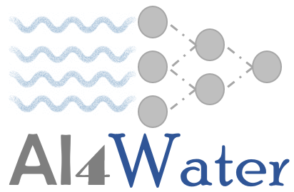

.. ai4water documentation

Welcome to ai4water's documentation!
====================================

.. toctree::
   :maxdepth: 2

   installation
   quick_start

.. toctree::
   :maxdepth: 2
   :caption: modules

   model
   datasets
   preprocessing
   postprocessing
   eda
   hpo
   experiments
   evapotranspiration
   utils

paper
=====
AI4Water v1.0: An open source python package for modeling hydrological time series using data-driven methods

https://doi.org/10.5194/gmd-2021-139

BibTeX entry
::
    @article{atr2022GMD,
      title={AI4Water v1.0: An open source python package for modeling hydrological time series using data-driven methods},
      author={Abbas, Ather and Boithias, Laurie and Pachepsky, Yakov and Kim, Kyunghyun and Chun, Jong Ahn and Cho, Kyung Hwa},
      journal={Geoscientific Model Development},
      year={2022},
      doi={https://doi.org/10.5194/gmd-2021-139},
      publisher={Copernicus}
    }

Indices and tables
==================

* :ref:`genindex`
* :ref:`modindex`
* :ref:`search`
