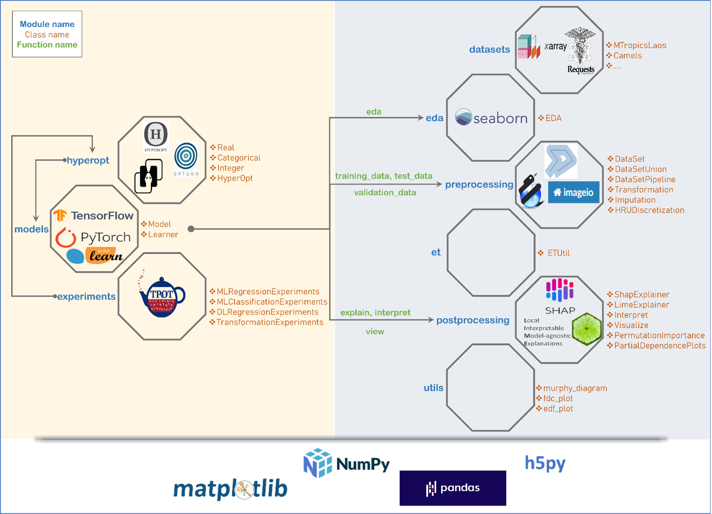

.. _understanding:

Understanding ai4water
***********************
Most of the technical details of ai4water are available in the ai4water paper_ . Here
we provide the most important technical highlights.

Model Definition
==================
In ai4water, the user can define the machine learning model using the `model` argument
in Model class. For scikit-learn, lightgbm, catboost and xgboost based models, the
method is illustrated in :ref:`quick_start`. For neural network based models, there are two ways
of model definition. For most basic usage cases, the user can adopt the functions
available in :ref:`nn_funcs`. However, the user can also define models using json style
dictionaries. This method of definition style for tensorflow and pytorch is given below

.. toctree::
   :maxdepth: 2

   declarative_def_tf
   declarative_def_torch

Module Structure
=================

Module Hierarchy
==================
At the core of ai4water is the `Model` class. The HyperOpt class is above it because
it it calls the Model class during each of hyperparameter iteration. The Experiments
class is further up, because it involves hyperparameter optimization for each of the model
considered.

Module linkage
===============
The information flow in the ai4water framework is illustrated in following diagram.

.. _paper:
    https://gmd.copernicus.org/articles/15/3021/2022/